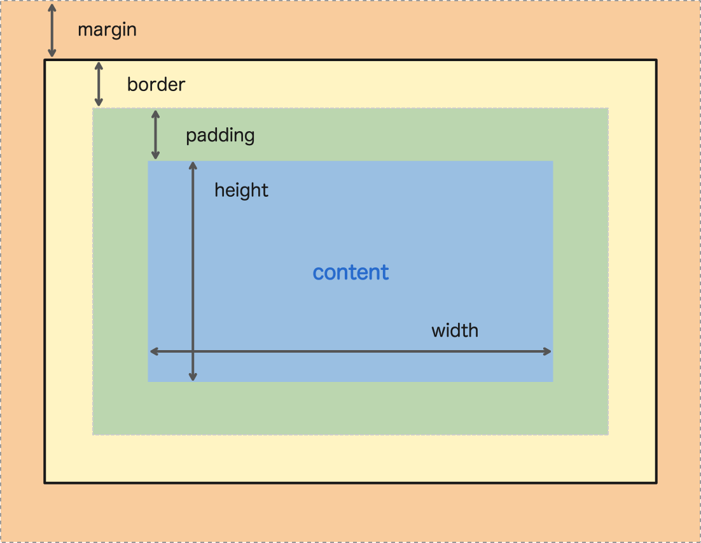

## CSS

- CSS의 기능
- HTML에 CSS 적용하는 방법
- CSS 기본 문법
- CSS의 Box Model과 게임 배경 준비
- Image Sprites 기법과 용사 추가
- CSS 선택자 - 조합, 그룹, 가상
- CSS의 position으로 용사 위치 잡기

---

## CSS 적용 방법

```html
<!-- Inline Style -->
<a href="index.html" style="color: red">Ghost Rain</a>

<!-- Style Tag -->
<head>
  <style>
    h1 {
      color: red;
    }
  </style>
</head>

<!-- Link Tag -->
<head>
  <link rel="stylesheet" href="style.css" />
</head>
```

## CSS 문법

```css
선택자(Selector) {
  속성(property): 값(value);
}

/* id (중복이 되어선 안됨) */
/* <h1 id="html"><h1> */
#html {
  color: red;
}

/* class (중복 사용 가능) */
/* <h1 class="html"><h1> */
.html {
  color: red;
}
```

## CSS Box Model



## Image Sprite

- 화면에 필요한 이미지 하나하나가 파일이고 네트워크 요청을 하기 때문에 비용이 든다.
- 하나의 그림 파일에 모든 이미지를 담아서 위치를 조정하여 사용하는 방법
- 네이버에서도 사용하는 기술

## CSS Selector

- Grouping으로 한번에 같은 스타일을 반영할 수 있음 (',')

```css
div,
span {
  background-color: red;
}
```

- 조합 (부모-자식 관계는 한 칸 띄어쓰기가 필요)

```css
.pre span {
  background-color: red;
}

p {
  color: red;
}

/* p 태그이면서 p-class 클래스인 요소 */
p.p-class {
  color: gray;
}

/* p 태그이면서 p-id id인 요소 */
p#p-id {
  text-decoration: underline;
}
```

- 조합 우선 순위 (Inline Style : 1000, id: 100, class: 10, tag: 1

## CSS Positioning

- `absolute`는 부모를 기준으로 동작 (단, 부모에는 `relative, absolute, fixed` 중 하나를 가져야함)
- `fixed`는 브라우저의 화면을 기준으로 요소를 위치 시킴

## Ghost Rain Game CSS Alignment

> 참고 : https://flexboxfroggy.com/#ko


